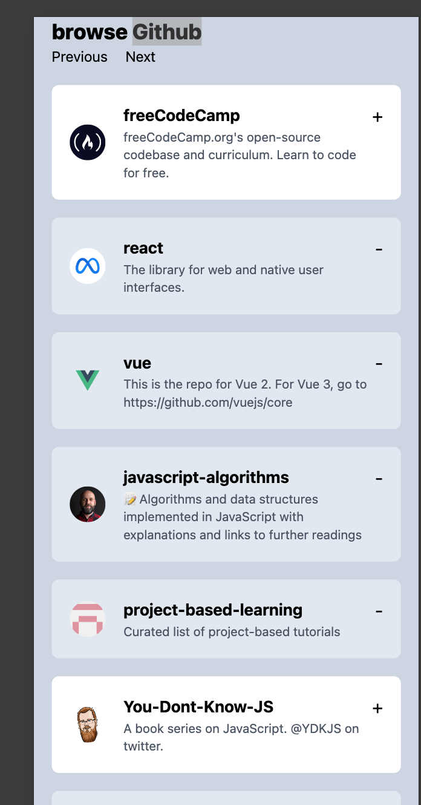

# Introduction

This is a Github browser sample project. 

## Tech stack

Following tech stack is used for this demo work.

- package manage: pnpm
- workspace: nx
- front end: react
- functional tests: playwright

## How to setup the project

- Clone the repository
- Install pnpm as I have used this for this project. Please [follow this link](https://pnpm.io/installation)
- Once pnpm is installed please install the dependencies you have to navigate to each workspace and run ``` pnpm install ``` command.

### How to run unit tests

To run unit tests please execute ```pnpm test ``` under the root folder.

### How to run E2E / Functional tests

To run e2e tests please execute ```pnpm e2e``` under the root folder.

### Demo

